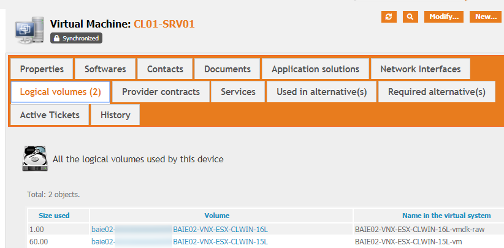

# itop-vsphere-datacollector-extension
Some extensions I made in the VSphere Data Collector

I did some extensions to the VShere Data Collector for iTop.

While some of them are very specific to our environment, I put the whole here, it can be useful for other.

# Version 1.0.12 of the collector
Combodo released a version 1.0.12 of the collector mid april 2020. This new version came with a really nice option, letting you 'overload' the value of fields of the json file from the param.local.xml file. That's cool, because most of the people only do changes in the json file (few are crazy enough to cut in the php files -I am...) So, with this change, people could easily only do their customization in the param.local.xml file, and they should not fear the next update.

But...

This is a first version of this brand new feature, and it was not activated in all 8 classes (why ?)

Also, It was feasible to change any attributes of a field in the json file, but not a common param. I commonly change the 'user_delete_policy' from 'nobody' to 'administrators', and this was not feasible in the version 1.0.12. It's possible in my custom version.

So, the set of modified file is reduced, but (bad news, the files modified are not anymore all in the collector sub dir, I also add to change the exec.php to include one more library.

## complete list of changes :
vsphere-data-collector-1.0.12/collectors/ConfigurableCollector.class.inc.php
* Extends the comments for the <user_delete_policy> field
* Adds the logic to deal with this parameter

vsphere-data-collector-1.0.12/collectors/vSphereBrandCollector.class.inc.php
vsphere-data-collector-1.0.12/collectors/vSphereFarmCollector.class.inc.php
vsphere-data-collector-1.0.12/collectors/vSphereModelCollector.class.inc.php
vsphere-data-collector-1.0.12/collectors/vSphereOSFamilyCollector.class.inc.php
vsphere-data-collector-1.0.12/collectors/vSphereOSVersionCollector.class.inc.php
* Just modify the class definition to extend not the Collector class, but the ConfigurableCollector class

vsphere-data-collector-1.0.12/collectors/vSphereHypervisorCollector.class.inc.php
* Collect the serial number, the IP address  and the UUID to inject later in the Server Object

vsphere-data-collector-1.0.12/collectors/vSphereServerCollector.class.inc.php
* put back here the data collected in the Hypervisor Class

vsphere-data-collector-1.0.12/collectors/vSphereServerCollector.json
* Add here the configuration for the field S_UUID where I actually store the server's UUID 
--> Could I add also a complete definition of a field in the param.local file ?

vsphere-data-collector-1.0.12/collectors/vSphereVirtualMachineCollector.class.inc.php
* Just modify the class definition to extend not the Collector class, but the ConfigurableCollector class
--> I think this one was missed in your distribution set
* Adds a bazillion fields to collect a lot of stuff I found useful for our VM. YMMV!

vsphere-data-collector-1.0.12/collectors/vSphereVirtualMachineCollector.json
* Add here the definition for my bazillion new fields!

vsphere-data-collector-1.0.12/collectors/vSphereVirtualMachineTeemIpCollector.class.inc.php
* Did here two modifications because I changed an underlying funct in the vSpherVirtualMachine class
--> Never tested it, as I don't use TeemIP

vsphere-data-collector-1.0.12/exec.php
* Add here require_once(APPROOT.'collectors/ConfigurableCollector.class.inc.php'); 
--> Vithout this line, the <user_delete_policy> wasn't honored.

All changes are in the 1.0.12 subdir, along with a zip file. But be warned : lots of changes suposse that you have also changed your datamodel like me.
So use these files as an insparation, not more !

# Installation

As I edit directly the main branch files, you really need to use the files for the same version as your datacollector. The changes I made are all in the 'collector' sub directory of the datacollector module so you have to replace some or all of the files in this directory.

As of today, you'll find here or in the .zip file a subdirectory named collectors-1.0.11, and a subdirectory called version 1.0.12. This are the complete set of the file for the same version. Don't try it on other versions (well, not to much changes upstream between 1.0.10 and 1.0.11, but the 1.0.9 was completely different)

But just copying my files over the original may works ...or not. It's quite possible that I reference Custom destination fields in iTop that you may or may not have.

This is more to use as a source of inspiration :)

# Changes from upstream for 1.0.11

(This list is probably not complete)

## Hypervisor Server

Collect the Serial Number, the UUID (in a non standard field named S_UUID) and the IP management address

## Virtual Machine

Collect for each VM the space usage on each Datastore (but this works because of other tasks I have collecting on my disk Array datastore informations)...

A picture better than a long text :

Collect the custom attributes, but most of them are for custom fields in iTop..

Collect the UUID (also for a custom field S_UUID)

For the OS : instead of using the VMware value 'OS from configuration field' I use (i available) the VMware value 'OS according to VMware tools' that I find more accurate.

I position the VM on the correct location (also a custom extension, and these tests are totally specific!). This is to know in wich Datacenter the VM is.

I position the 'move2production' date from one of our Custom attributes (again very specific).

Collect the VCenter, as an URL so I can jump from iTop to the good VCenter (useless if you have only one !)

Collect the PowerStatus of the VM : in some extractions, I only count 'poweredOn' VM

Many attributes are now updatables.

